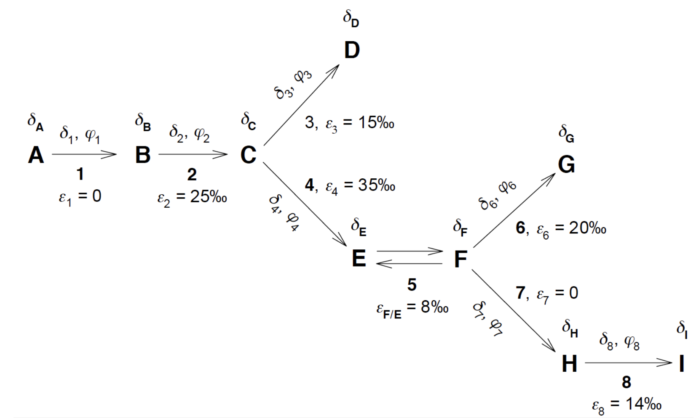

---

```{r "load packages", include=FALSE, message=FALSE}
library(tidyverse)
library(isocyclr)
```

# Introduction

Stable carbon isotopes are often used as tracers of methane through the global carbon cycle. However, there is insufficient understanding of the different processes that contribute methane to the atmosphere and hydrosphere and of the impact that various biochemical pathways have on the fractionation of the carbon. From Londry et al., 2008, we've learned that substrate type and availability affect the d13C of products M. barkeri produce during methanogenesis. In the paper, four different substrates (H2/CO2, acetate, methanol, and TMA) at different availabilities (limited vs. abundant) were used to understand fractionation affects on the d13C of lipids, biomass, and methane. In this exercise, we are going to create a model to explore the differences in fractionation between biomass, lipids, and methane produced by M. barkeri using the substrate methanol at abundant concentrations (although organic substrates are normally not found in abundance in nature...). 

Below, you will find a schematic of the carbon assimilation and dissimilation pathways in methanogens. For this exercise, we are going to be looking specifically at the methanol pathway. 

```{r}
knitr::include_graphics("Schematic.png")
```

## Question 1
The methanol pathway has both anabolic and catabolic components. The anabolic component results in the formation of lipids and bulk biomass and the catabolic component produces methane. Looking at these pathways in the schematic, what factors would impact the isotopic difference between the substrate (methanol) and products (total biomass and methane)?
### Answer: The relative fluxes of carbon to various products at any branch point, the fractionations imposed by each enzyme, and the reversibility of each of the enzymes are all important factors in determining the isotopic difference between substrate and any particular product.


# Methanol Schematic

We are going to start off by creating a reaction network of carbon based upon the model in John Hayes’ Fractionation of carbon and hydrogen isotopes in biosynthetic processes. Rev Mineral Geochem 43, 225–277. (2001). In this model, letters indicate carbon positions within reactants and products, delta represents isotopic compositions of these positions, epsilon represents the isotope effect associated with the reaction, and phi represents the flux of carbon being transmitted (moles/time).

```{r}

```

General relationships:

$$
\text{Transmission of isotopic composition from reactant to product}: \ \delta_p = \delta_R - \epsilon \\
\text{Mass balance for total carbon:} \ \phi_2 = \phi_3 + \phi_4 \\ 
$$

## Task 1: Please add the relevant fluxes to the schematic below and generate a reaction diagram.


```{r, fig.width=10}
methanogen <- isopath() %>%
  add_isotope("d13C") %>%
  # components
  add_component(c("MeOH", "CO2"), d13C, variable = FALSE) %>%
  add_component(c("CH4", "meS", "actCoA", "lipids", "obio", "biomass"), d13C) %>%
  add_component(c("CH4Sink", "biomassSink"), d13C, variable = FALSE) %>%
  # methanol uptake
  add_custom_reaction(
    MeOH == meS, flux = net, flux.d13C = MeOH.d13C, name = "1. methanol uptake"
  ) %>%
  # methane generation
  add_custom_reaction(
    meS == CH4, flux = f_CH4 * net, flux.d13C = meS.d13C + eps_CH4, name = "2. methane generation"
  ) %>%
  # CO2 generation
  add_custom_reaction(
    meS == CO2, flux = f_CO2 * net, flux.d13C = meS.d13C, name = "3. CO2 generation"
  ) %>%
  # biomass generation
  add_custom_reaction(
    meS + CO2 == actCoA, 
    flux = 2 * (1 - f_CH4 - f_CO2) * net, flux.d13C = meS.d13C + eps_actCoA, 
    name = "4. acetyl CoA generation", abscissa = 4
  ) %>%
  # methane outflux
  add_custom_reaction(
    CH4 == CH4Sink,
    flux = f_CH4 * net, flux.d13C = CH4.d13C, name = "methane loss", 
    abscissa = 3
  ) %>%
  # other biomass
  add_custom_reaction(
    2 * actCoA + 1 * CO2 == obio, # why 2 * actCoA?
    flux = (3/2) * (1 - (f_lipid  * 2 * (1 - f_CH4 - f_CO2))), flux.d13C = actCoA.d13C + eps_obio,
    name = "5. other biomass generation",
    abscissa = 5
  ) %>%
  # lipids
  add_custom_reaction(
    actCoA == lipids,
    flux = f_lipid  * 2 * (1 - f_CH4 - f_CO2), flux.d13C = actCoA.d13C + eps_lipid,
    name = "6. lipid generation",
    abscissa = 5
  ) 


methanogen%>%generate_reaction_diagram(add_arrows = TRUE)
```

## System of differential equations

```{r}
path %>% get_ode_matrix() %>% knitr::kable()
```

## Assign parameters

```{r}
params <- tibble(
      scenario = c("low flux", "high flux"),
      # fluxes and flux fractions
      dm = c(0.1, 1), f2 = 0.2, f4 = 0.2,
      # isotopic effects
      e1 = 0, e2 = 80, e3 = 10, e4 = 10, e5 = 5, e6 = 5, e7 = 15, e8 = 5,
      # starting isotopic composition
      AA.carbon = -.0462, B.carbon = 0, C.carbon = 0, D.carbon = 0, E.carbon = 0, F.carbon = 0,
      # pool sizes for variable components
      B = 10, C = 5, D = 20, E = 10, F = 5
      )
params
```

## Set paramaters for the iso path

```{r}
path <- path %>% set_parameters(params)
```

## Run model

```{r, warning=FALSE}
model <- path %>% run_model(time_steps = 500)
```

## Plot time course

```{r time_course, fig.width = 8, fig.height = 6}
model %>% 
  pivot_longer(names_to = "reservoir", values_to = "delta", ends_with("carbon")) %>%
  ggplot() + aes(time, delta, color = reservoir, size = ) +
  geom_line() + theme_bw() +
  labs(y = expression(delta*13*'C')) +
  facet_grid(~scenario)
```

## Task 2: Increase flow to the anabolic pathway.

##Question 2 
How does a higher flow to the anabolic pathway of the schematic effect the d13C values of methane, biomass, and lipids? 
### Answer: 


# Differences between 13C of methanol and M. barkeri products

In the Londry et al., 2008 paper, it was determined that abundant methanol produces large differences in fractionation from substrate to lipids, biomass, and methane. 

Calculate the differences in isotope fractiontion between lipids, biomass, and methane using the following carbon fractionation equation: 
$$
\Delta\delta^{13}C = \delta^{13}C_{substrate} - \delta^{13}C_{product}  
$$
```{r}
d_d13c_biomass <-
  
d_d13c_lipids <-
  
d_d13c_ch4 <- 
```

## Question 3: Which product of M. barkeri has the greatest fractionation compared to substrate? Does this match with the results of the Londry et al. 2008 paper (table and figure below)?

```{r}
knitr::include_graphics("Table 3.png")
knitr::include_graphics("Figure 2.png")
```


